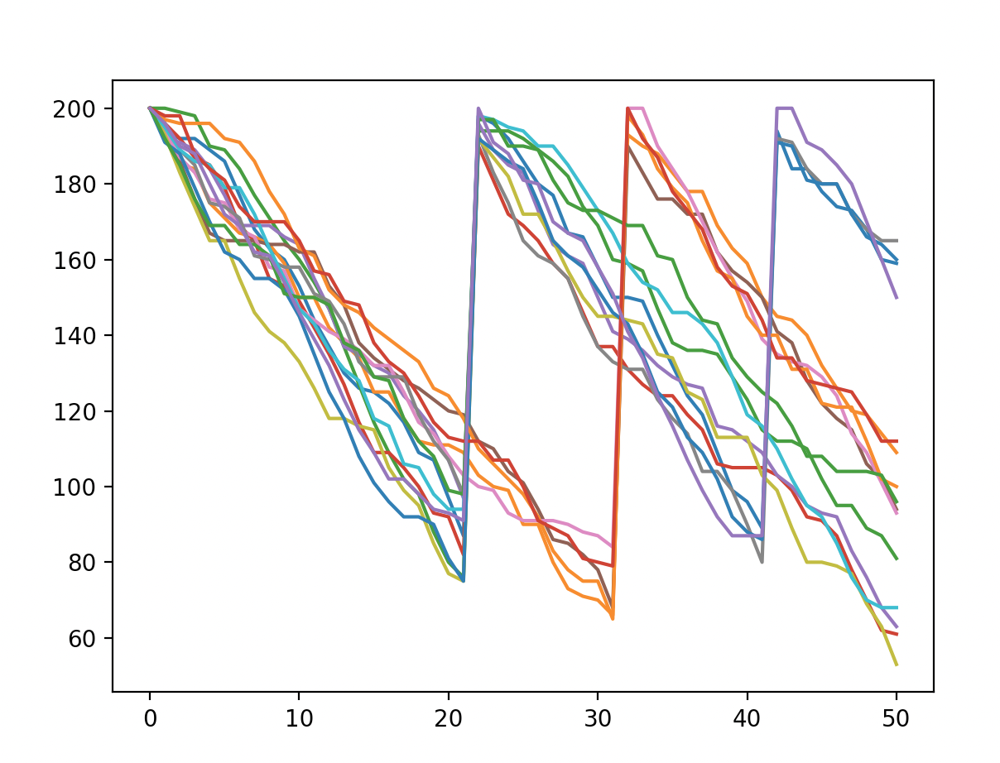

*****************
Coding Challenges
*****************
In an effort to keep my repository clean, this repository contains various coding challengers the derive from fun, interviews and any other source that doesn't need to be in it's own repository.

Challenge 1
###########
A math based challenge for printing an incrementing numbers based on an arbitrar value given. For example when given a value of 3, the following 2d list is generated.
::

  python3 magicSquare.py 
  [6, 1, 8]
  [3, 7, 5]
  [9, 4, 2]

Challenge 2
###########
3 python based exercices derived from a coding interview submission.

1. Takes a list of string based number values and prints an integer form to STDOUT. For example, given an input of 
::

  words = ["six", "negative seven hundred twenty nine", "one million one hundred one", "three thousand forty one"]

STDOUT will product the following 
::

  python3 challenge1.py
  6
  -729
  1000101
  3041

2. Given a large string, find and print to STDOUT the largest palandrome found. For example, given an input of 
::

  nsecrateditfaraboveourpoorponwertoaddo
  memberwhatwesayherebutitcanneverraceca
  edicatedheretotheulnfinishedworkwhicht
  tisratherforustoracecarebeherededicate
  ddeadwetakeincreaseddevotitattarrattat

STDOUT will product the following 
::

  python3 challenge2.py 
  tattarrattat of size 12

3. Given a list of substrings and a list of strings, attempt to create the entire string. For example, given an input of
::

  words = ["albums", "barely", "befoul", "convex",
           "hereby", "jigsaw", "tailor", "weaver"]

  pieces = ["al", "bums", "bar", "ely", "be", "foul",
            "con", "vex", "here", "by", "jig", "saw",
            "tail", "or", "we", "aver"]
            
STDOUT will product the following 
::

  al + bums => albums
  albums != barely
  albar != barely
  alely != barely
  albe != barely
  ...
  
  
Challenge 3
###########
A product ordering system. Simulates product purchasing and implements a simple ordering system to purchase products when low. 

